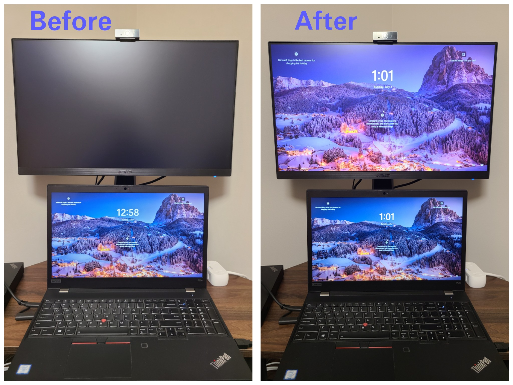

# Wintermelon
***Wintermelon*** is a C# workaround that emulates dual/multi monitor lockscreen feature in Windows 10/11. The ability to duplicate lockscreen existed until Windows 7 but Windows 10 & 11 have chosen to forgo this feature by displaying the lockscreen only on primary (or main) display while the secondary (or non-main) displays go black.

The name ***Wintermelon*** is an acronym with 2 possible expansions:

- **WIN**dows **T**en & **E**leven **R**endering of **M**irrored **E**vent-triggered **L**ockscreens **O**n **N**on-main displays

- **WIN**dows **T**en & **E**leven **R**estorer of **M**ultiple **E**quivalent **L**ockscreens **O**n **N**on-main displays

Here's a demo showing Wintermelon in action on Windows 11:

## How it works ##
In Windows 10 & 11, lockscreen will appear on multiple displays only if the display projection mode (accessed by pressing Win+P hotkey) is set to "Duplicate". Most users will typically use primary/secondary (main/non-main) monitors in "Extend" mode to multitask between various opened application windows. Wintermelon sets up a scheduled task that monitors for lock/unlock events. When a lock event is detected the projection mode is switched to "Duplicate" which will replicate the main display's lockscreen across all non-main displays and when an unlock event is triggered the projection mode will revert to "Extend" mode.
Before switching to "Duplicate" mode the position of opened application windows on the desktop are recorded since the duplication of displays will cause all windows to collapse on to the primary/main display. When reverting to "Extend" mode following the unlock event the recorded positions are retrieved and used to reposition the application windows to their original state.

## Requirements ##
Wintermelon is a C# project relying on .NET Core 3.1 and it was originally developed on & for Windows 10 using Visual Studio 2019.

To build Wintermelon executable you'll need:

1) [.NET Core 3.1](https://dotnet.microsoft.com/en-us/download/dotnet/3.1)

2) [Visual Studio](https://visualstudio.microsoft.com/vs/older-downloads/)

3) Windows machine

To test and install Wintermelon you'll need:

1) Windows 10 or Windows 11 machine

2) PowerShell

The installer for the C# executable is a PowerShell script which will need to be executed by running it within a PowerShell terminal launched using administrator mode.

## Building the executable ##

1) Open the solution file *Wintermelon.sln* in Visual Studio. The source code resides in *Program.cs*.

2) Build the solution by choosing **Build --> Build Solution (Ctrl+Shift+B)** in the menu bar.

3) If there are no build errors then select **Build --> Publish Wintermelon** and pass the following publish information:

    **Target location**=bin\Release\netcoreapp3.1\publish\

    **Configuration**=Release

    **Delete existing files**=false

    **Target Framework**=netcoreapp3.1

    **Target Runtime**=win-x64

    Expand "**Show all**" and set the options under it to following values:

    **Configuration**=Release | Any CPU

    **Target framework**=netcoreapp3.1

    **Deployment mode**=Framework-dependent

    **Target runtime**=win-x64

    **Target location**=bin\Release\netcoreapp3.1\publish\

    Expand "**File publish options**", set **Produce single file** as checked and leave **Enable ReadyToRun compilation** unchecked.

4) Press Publish button which will generate the executable **Wintermelon.exe** at the path *bin\Release\netcoreapp3.1\publish\Wintermelon.exe* relative to the C# solution folder.

This executable handles the switching of projection mode between Duplicate and Extend modes and does recording, retrieval of window positions from a text file saved at *C:\Users\Your_Username\AppData\Local\Wintermelon\winpos.txt*.

## Using Wintermelon ##
To monitor lock/unlock event and switch the projection mode two separate scheduled tasks will need to be registered with the Windows Task Scheduler. These tasks are:

- Task 1 : **Wintermelon screen lock save window position clone display**
- Task 2 : **Wintermelon screen unlock extend display restore window**

The PowerShell scripts *install_wintermelon.ps1* and *uninstall_wintermelon.ps1* will need to be executed to register or unregister the aforementioned tasks, respectively.

### Registering the Scheduled tasks ###
- Open PowerShell by going to Start Menu, searching for Windows PowerShell and choosing "Run As Administrator" from right lick context menu.

- To register the tasks run the following command

    `powershell -File install_wintermelon.ps1`

- Open Task Scheduler from Start Menu and you should see 2 new tasks under Task Scheduler Library with names beginning with *Wintermelon*. The Actions tab for these 2 scheduled tasks will list Wintermelon.exe as the program that should start when these tasks are triggered. Task 1 will invoke Wintermelon.exe by passing the argument 'save' while task 2 will invoke Wintermelon.exe by passing the argument 'restore'.

- Lock the display by pressing Win+L keys and the lockscreen will appear on all displays.

- Enter your login credentials to unlock the displays. When the displays are unlocked they are all in duplicate mode momentarily and then the C# app fetches the positions of active application windows and relocates them to the appropriate positions. This requires a 3 second wait and is a limitation of this workaround.

### Unregistering the Scheduled tasks ###
- To unregister the tasks run the following command

    `powershell -File uninstall_wintermelon.ps1`

- Open Task Scheduler from Start Menu and you should no longer see the 2 tasks with names beginning with *Wintermelon* under Task Scheduler Library.

